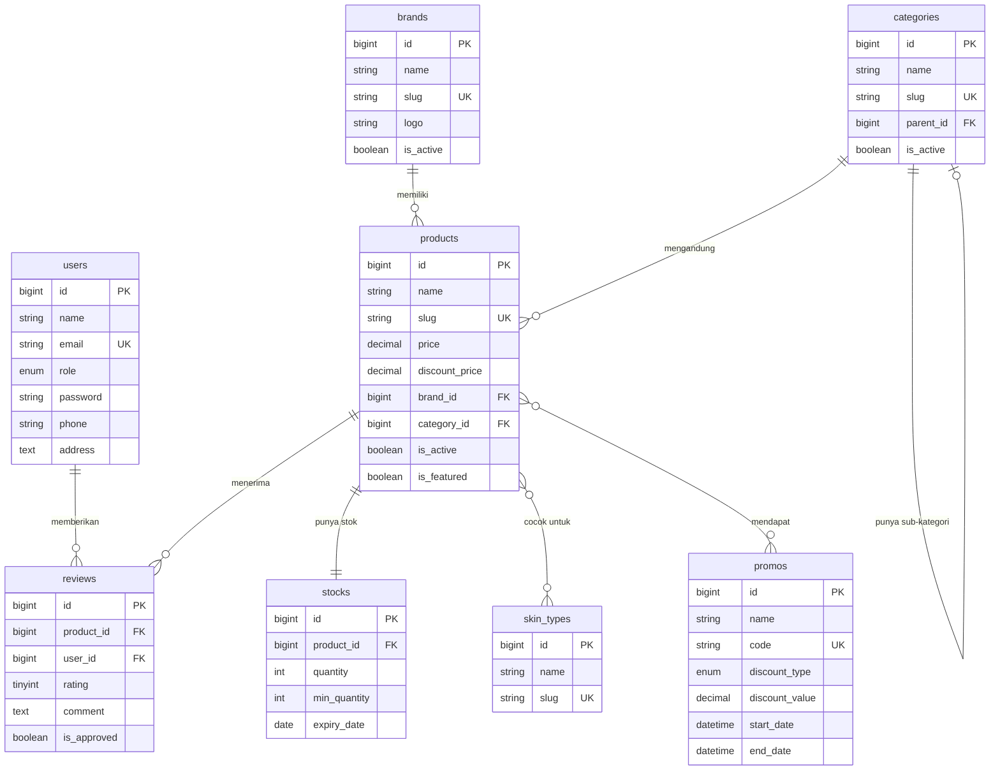

# Dokumentasi Sistem E-Beauty
## Katalog Produk Kecantikan Online

---

## 1. Pendahuluan

### 1.1 Apa itu E-Beauty?

**E-Beauty** adalah sebuah aplikasi web berbasis **Laravel 10** yang berfungsi sebagai **katalog produk kecantikan online**. Aplikasi ini memungkinkan pelanggan untuk menjelajahi berbagai produk kecantikan seperti skincare, makeup, bodycare, dan haircare dari berbagai brand ternama.

### 1.2 Tujuan Aplikasi

Tujuan utama dari aplikasi E-Beauty adalah:
1. Menyediakan platform bagi pelanggan untuk **mencari dan membandingkan** produk kecantikan.
2. Memberikan **informasi lengkap** tentang setiap produk (kandungan, cara pakai, harga, review).
3. Membantu pelanggan menemukan produk yang **sesuai dengan tipe kulit** mereka.
4. Menyediakan **panel admin** untuk mengelola seluruh konten katalog.

### 1.3 Teknologi yang Digunakan

| Komponen | Teknologi | Penjelasan |
|----------|-----------|------------|
| **Backend** | Laravel 10, PHP 8.x | Framework PHP untuk membangun logika bisnis dan API |
| **Frontend** | Blade Templates, Bootstrap 5 | Template engine Laravel + CSS framework untuk tampilan |
| **Database** | MySQL | Sistem manajemen database relasional |
| **Authentication** | Laravel Auth | Sistem login/register bawaan Laravel |
| **Web Server** | Apache/Nginx (via Laragon) | Server lokal untuk development |

---

## 2. Pengguna Sistem (Aktor)

Aplikasi E-Beauty memiliki **2 jenis pengguna** dengan hak akses berbeda:

### 2.1 Customer (Pelanggan)

**Siapa**: Pengunjung website yang ingin melihat katalog produk.

**Kemampuan**:
- Melihat halaman beranda dengan produk unggulan
- Menjelajahi katalog produk
- Menggunakan filter (kategori, brand, tipe kulit, harga)
- Melihat detail lengkap produk
- Membuat akun dan login
- Memberikan review dan rating produk (setelah login)

### 2.2 Admin (Administrator)

**Siapa**: Pengelola website yang bertanggung jawab atas konten.

**Kemampuan**:
- Semua kemampuan Customer
- Mengelola data produk (tambah, edit, hapus)
- Mengelola data brand
- Mengelola data kategori
- Mengelola stok produk
- Mengelola promo/diskon
- Memoderasi review (approve/reject)
- Melihat statistik dashboard

---

## 3. Struktur Database (Untuk ERD)

### 3.1 Pengantar

Database E-Beauty terdiri dari **10 tabel** yang saling berelasi. Pemahaman tentang struktur database ini penting untuk membuat **Entity Relationship Diagram (ERD)**.

### 3.2 Daftar Tabel

| No | Nama Tabel | Fungsi | Jumlah Kolom |
|----|------------|--------|--------------|
| 1 | `users` | Menyimpan data pengguna | 11 |
| 2 | `brands` | Menyimpan data merek produk | 7 |
| 3 | `categories` | Menyimpan data kategori produk | 8 |
| 4 | `skin_types` | Menyimpan data jenis kulit | 5 |
| 5 | `products` | Menyimpan data produk utama | 18 |
| 6 | `product_skin_types` | Tabel penghubung produk ↔ tipe kulit | 4 |
| 7 | `stocks` | Menyimpan data stok produk | 8 |
| 8 | `reviews` | Menyimpan data ulasan pelanggan | 10 |
| 9 | `promos` | Menyimpan data promo/diskon | 15 |
| 10 | `promo_products` | Tabel penghubung promo ↔ produk | 4 |

---

### 3.3 Detail Struktur Setiap Tabel

#### **Tabel 1: users (Pengguna)**

**Fungsi**: Menyimpan data semua pengguna yang terdaftar di sistem, baik Admin maupun Customer.

| Kolom | Tipe Data | Keterangan | Penjelasan |
|-------|-----------|------------|------------|
| id | BIGINT | Primary Key, Auto Increment | Nomor unik untuk setiap pengguna |
| name | VARCHAR(255) | NOT NULL | Nama lengkap pengguna |
| email | VARCHAR(255) | UNIQUE, NOT NULL | Alamat email (untuk login) |
| email_verified_at | TIMESTAMP | NULLABLE | Waktu verifikasi email (opsional) |
| password | VARCHAR(255) | NOT NULL | Password yang sudah dienkripsi |
| role | ENUM | 'admin' atau 'customer' | Menentukan hak akses pengguna |
| phone | VARCHAR(255) | NULLABLE | Nomor telepon (opsional) |
| address | TEXT | NULLABLE | Alamat lengkap (opsional) |
| avatar | VARCHAR(255) | NULLABLE | Path file foto profil |
| remember_token | VARCHAR(100) | NULLABLE | Token untuk fitur "Ingat Saya" |
| created_at | TIMESTAMP | Auto | Waktu akun dibuat |
| updated_at | TIMESTAMP | Auto | Waktu terakhir akun diupdate |

**Penjelasan Tambahan**:
- Kolom `role` menentukan apakah pengguna adalah admin atau customer.
- Password disimpan dalam bentuk hash (terenkripsi) menggunakan bcrypt.

---

#### **Tabel 2: brands (Merek)**

**Fungsi**: Menyimpan data semua merek/brand produk kecantikan yang tersedia di katalog.

| Kolom | Tipe Data | Keterangan | Penjelasan |
|-------|-----------|------------|------------|
| id | BIGINT | Primary Key, Auto Increment | Nomor unik untuk setiap brand |
| name | VARCHAR(255) | NOT NULL | Nama brand (cth: "Wardah", "Somethinc") |
| slug | VARCHAR(255) | UNIQUE | URL-friendly name (cth: "wardah") |
| logo | VARCHAR(255) | NULLABLE | Path file logo brand |
| description | TEXT | NULLABLE | Deskripsi/informasi tentang brand |
| is_active | BOOLEAN | DEFAULT TRUE | Status aktif (tampil/tidak di website) |
| created_at | TIMESTAMP | Auto | Waktu data dibuat |
| updated_at | TIMESTAMP | Auto | Waktu terakhir diupdate |

**Penjelasan Tambahan**:
- Kolom `slug` digunakan untuk URL yang SEO-friendly (contoh: `/catalog?brand=wardah`).
- Jika `is_active` = FALSE, brand tidak akan muncul di website customer.

---

#### **Tabel 3: categories (Kategori)**

**Fungsi**: Menyimpan data kategori produk. Kategori bisa memiliki sub-kategori (hierarki).

| Kolom | Tipe Data | Keterangan | Penjelasan |
|-------|-----------|------------|------------|
| id | BIGINT | Primary Key, Auto Increment | Nomor unik untuk setiap kategori |
| name | VARCHAR(255) | NOT NULL | Nama kategori (cth: "Skincare") |
| slug | VARCHAR(255) | UNIQUE | URL-friendly name |
| icon | VARCHAR(255) | NULLABLE | Class icon FontAwesome (cth: "fa-spa") |
| description | TEXT | NULLABLE | Deskripsi kategori |
| parent_id | BIGINT | Foreign Key → categories(id) | ID kategori induk (untuk sub-kategori) |
| is_active | BOOLEAN | DEFAULT TRUE | Status aktif |
| created_at | TIMESTAMP | Auto | |
| updated_at | TIMESTAMP | Auto | |

**Penjelasan Tambahan**:
- Kolom `parent_id` memungkinkan struktur hierarki. Contoh:
  - **Skincare** (parent_id = NULL) → Kategori utama
    - **Cleanser** (parent_id = 1) → Sub-kategori dari Skincare
    - **Moisturizer** (parent_id = 1) → Sub-kategori dari Skincare
- Ini disebut **Self-Referencing Relationship** (kategori merujuk ke dirinya sendiri).

---

#### **Tabel 4: skin_types (Jenis Kulit)**

**Fungsi**: Menyimpan data jenis-jenis kulit untuk membantu pelanggan menemukan produk yang cocok.

| Kolom | Tipe Data | Keterangan | Penjelasan |
|-------|-----------|------------|------------|
| id | BIGINT | Primary Key, Auto Increment | Nomor unik |
| name | VARCHAR(255) | NOT NULL | Nama tipe kulit (cth: "Normal", "Oily", "Dry") |
| slug | VARCHAR(255) | UNIQUE | URL-friendly name |
| description | TEXT | NULLABLE | Deskripsi karakteristik tipe kulit |
| created_at | TIMESTAMP | Auto | |
| updated_at | TIMESTAMP | Auto | |

**Contoh Data**:
- Normal
- Oily (Berminyak)
- Dry (Kering)
- Combination (Kombinasi)
- Sensitive (Sensitif)

---

#### **Tabel 5: products (Produk)**

**Fungsi**: Tabel utama yang menyimpan semua data produk kecantikan.

| Kolom | Tipe Data | Keterangan | Penjelasan |
|-------|-----------|------------|------------|
| id | BIGINT | Primary Key | Nomor unik produk |
| name | VARCHAR(255) | NOT NULL | Nama produk lengkap |
| slug | VARCHAR(255) | UNIQUE | URL-friendly name untuk detail produk |
| description | TEXT | NULLABLE | Deskripsi produk |
| ingredients | TEXT | NULLABLE | Kandungan/komposisi produk |
| how_to_use | TEXT | NULLABLE | Cara penggunaan produk |
| price | DECIMAL(12,2) | NOT NULL | Harga normal dalam Rupiah |
| discount_price | DECIMAL(12,2) | NULLABLE | Harga diskon (jika ada) |
| sku | VARCHAR(255) | UNIQUE | Stock Keeping Unit (kode unik inventori) |
| image | VARCHAR(255) | NULLABLE | Path gambar utama produk |
| gallery | JSON | NULLABLE | Array path gambar tambahan |
| weight | DECIMAL(8,2) | NULLABLE | Berat produk dalam gram |
| size | VARCHAR(255) | NULLABLE | Ukuran produk (cth: "30ml", "50g") |
| brand_id | BIGINT | Foreign Key → brands(id) | ID brand pemilik produk |
| category_id | BIGINT | Foreign Key → categories(id) | ID kategori produk |
| is_active | BOOLEAN | DEFAULT TRUE | Status aktif (tampil/tidak) |
| is_featured | BOOLEAN | DEFAULT FALSE | Produk unggulan (tampil di homepage) |
| created_at | TIMESTAMP | Auto | |
| updated_at | TIMESTAMP | Auto | |
| deleted_at | TIMESTAMP | NULLABLE | Untuk Soft Delete |

**Penjelasan Tambahan**:
- `brand_id` dan `category_id` adalah **Foreign Key** yang menghubungkan produk ke tabel brands dan categories.
- `discount_price` diisi jika produk sedang diskon. Jika NULL, berarti tidak ada diskon.
- `deleted_at` digunakan untuk **Soft Delete** — produk tidak benar-benar dihapus dari database, hanya ditandai sebagai "dihapus".

---

#### **Tabel 6: product_skin_types (Tabel Pivot)**

**Fungsi**: Tabel penghubung antara produk dan tipe kulit (relasi Many-to-Many).

| Kolom | Tipe Data | Keterangan | Penjelasan |
|-------|-----------|------------|------------|
| id | BIGINT | Primary Key | |
| product_id | BIGINT | Foreign Key → products(id) | ID produk |
| skin_type_id | BIGINT | Foreign Key → skin_types(id) | ID tipe kulit |
| created_at | TIMESTAMP | Auto | |
| updated_at | TIMESTAMP | Auto | |

**Penjelasan Tambahan**:
- Tabel ini diperlukan karena **satu produk bisa cocok untuk banyak tipe kulit**, dan **satu tipe kulit bisa memiliki banyak produk** yang cocok.
- Contoh: Produk "A" cocok untuk kulit Normal dan Combination → ada 2 record di tabel ini.

---

#### **Tabel 7: stocks (Stok)**

**Fungsi**: Menyimpan data stok/inventori untuk setiap produk.

| Kolom | Tipe Data | Keterangan | Penjelasan |
|-------|-----------|------------|------------|
| id | BIGINT | Primary Key | |
| product_id | BIGINT | Foreign Key → products(id) | ID produk |
| quantity | INT | DEFAULT 0 | Jumlah stok tersedia |
| min_quantity | INT | DEFAULT 5 | Batas minimum untuk alert stok menipis |
| warehouse_location | VARCHAR(255) | NULLABLE | Lokasi penyimpanan di gudang |
| batch_number | VARCHAR(255) | NULLABLE | Nomor batch produksi |
| expiry_date | DATE | NULLABLE | Tanggal kadaluarsa |
| created_at | TIMESTAMP | Auto | |
| updated_at | TIMESTAMP | Auto | |

**Penjelasan Tambahan**:
- Relasi **One-to-One** dengan products (1 produk = 1 record stok).
- Jika `quantity` ≤ `min_quantity`, sistem akan menampilkan alert "Stok Menipis" di dashboard admin.

---

#### **Tabel 8: reviews (Ulasan)**

**Fungsi**: Menyimpan ulasan/review yang diberikan pelanggan untuk produk.

| Kolom | Tipe Data | Keterangan | Penjelasan |
|-------|-----------|------------|------------|
| id | BIGINT | Primary Key | |
| product_id | BIGINT | Foreign Key → products(id) | ID produk yang di-review |
| user_id | BIGINT | Foreign Key → users(id) | ID user yang memberi review |
| rating | TINYINT | 1-5 | Rating bintang |
| comment | TEXT | NULLABLE | Komentar/ulasan tertulis |
| images | JSON | NULLABLE | Array path gambar dari customer |
| is_verified_purchase | BOOLEAN | DEFAULT FALSE | Apakah customer benar-benar membeli |
| is_approved | BOOLEAN | DEFAULT FALSE | Status moderasi oleh admin |

**Penjelasan Tambahan**:
- Ada constraint UNIQUE(product_id, user_id) — artinya **1 user hanya bisa review 1 produk sekali**.
- Review baru memiliki `is_approved = FALSE` dan harus di-approve admin sebelum tampil di website.

---

#### **Tabel 9: promos (Promo)**

**Fungsi**: Menyimpan data promo/diskon yang bisa digunakan pelanggan.

| Kolom | Tipe Data | Keterangan | Penjelasan |
|-------|-----------|------------|------------|
| id | BIGINT | Primary Key | |
| name | VARCHAR(255) | NOT NULL | Nama promo (cth: "Diskon Akhir Tahun") |
| code | VARCHAR(255) | UNIQUE | Kode promo (cth: "BEAUTY50") |
| description | TEXT | NULLABLE | Deskripsi promo |
| discount_type | ENUM | 'percentage' atau 'fixed' | Jenis diskon (persen atau nominal tetap) |
| discount_value | DECIMAL(12,2) | NOT NULL | Nilai diskon (50 = 50% atau Rp 50.000) |
| min_purchase | DECIMAL(12,2) | NULLABLE | Minimum pembelian untuk pakai promo |
| max_discount | DECIMAL(12,2) | NULLABLE | Maksimum potongan (untuk persentase) |
| usage_limit | INT | NULLABLE | Batas total penggunaan promo |
| usage_per_user | INT | DEFAULT 1 | Batas penggunaan per user |
| used_count | INT | DEFAULT 0 | Jumlah sudah digunakan |
| start_date | DATETIME | NOT NULL | Tanggal mulai promo |
| end_date | DATETIME | NOT NULL | Tanggal berakhir promo |
| is_active | BOOLEAN | DEFAULT TRUE | Status aktif |

---

#### **Tabel 10: promo_products (Tabel Pivot)**

**Fungsi**: Tabel penghubung untuk promo yang berlaku pada produk tertentu saja.

| Kolom | Tipe Data | Keterangan | Penjelasan |
|-------|-----------|------------|------------|
| id | BIGINT | Primary Key | |
| promo_id | BIGINT | Foreign Key → promos(id) | ID promo |
| product_id | BIGINT | Foreign Key → products(id) | ID produk |

**Penjelasan Tambahan**:
- Jika promo berlaku untuk **semua produk**, tabel ini tidak perlu diisi.
- Jika promo hanya untuk **produk tertentu**, isi tabel ini dengan ID promo dan ID produk yang berlaku.

---

## 4. Diagram ERD (Entity Relationship Diagram)

### 4.1 Diagram dalam Format Mermaid

Diagram berikut bisa di-copy ke [Mermaid Live Editor](https://mermaid.live) untuk visualisasi:



### 4.2 Jenis-Jenis Relasi

| Relasi | Tipe | Penjelasan |
|--------|------|------------|
| users → reviews | One-to-Many | 1 user bisa memberikan banyak review (untuk produk berbeda) |
| products → reviews | One-to-Many | 1 produk bisa menerima banyak review dari user berbeda |
| brands → products | One-to-Many | 1 brand bisa memiliki banyak produk |
| categories → products | One-to-Many | 1 kategori bisa berisi banyak produk |
| categories → categories | Self-Reference | Kategori bisa punya parent (hierarki) |
| products ↔ skin_types | Many-to-Many | Produk bisa cocok untuk banyak tipe kulit, dan sebaliknya |
| products → stocks | One-to-One | 1 produk punya tepat 1 record stok |
| products ↔ promos | Many-to-Many | Promo bisa berlaku untuk banyak produk |

---

## 5. Alur Aplikasi (Application Flow)

### 5.1 Alur Customer (Pelanggan)

```
┌─────────────────────────────────────────────────────────────────────┐
│                        ALUR CUSTOMER                                │
├─────────────────────────────────────────────────────────────────────┤
│                                                                     │
│  [1] BUKA WEBSITE                                                   │
│       │                                                             │
│       ▼                                                             │
│  [2] HALAMAN HOME                                                   │
│       • Lihat produk unggulan (featured)                            │
│       • Lihat kategori populer                                      │
│       │                                                             │
│       ▼                                                             │
│  [3] KLIK "CATALOG" atau KATEGORI                                   │
│       │                                                             │
│       ▼                                                             │
│  [4] HALAMAN CATALOG                                                │
│       • Lihat daftar semua produk                                   │
│       • Gunakan filter (kategori, brand, tipe kulit, harga)         │
│       • Gunakan sorting (terbaru, termurah, rating)                 │
│       │                                                             │
│       ▼                                                             │
│  [5] KLIK SALAH SATU PRODUK                                         │
│       │                                                             │
│       ▼                                                             │
│  [6] HALAMAN DETAIL PRODUK                                          │
│       • Lihat gambar, deskripsi, kandungan, cara pakai              │
│       • Lihat harga dan status stok                                 │
│       • Lihat review dari customer lain                             │
│       │                                                             │
│       ├─── Belum Login ───► [7] Klik LOGIN                          │
│       │                          │                                  │
│       │                          ▼                                  │
│       │                     [8] HALAMAN LOGIN                       │
│       │                          │── Sudah punya akun ──► Login     │
│       │                          │── Belum punya akun ──► Register  │
│       │                          │                                  │
│       ◄──────────────────────────┘                                  │
│       │                                                             │
│  [9] SUDAH LOGIN                                                    │
│       │                                                             │
│       ▼                                                             │
│  [10] ISI FORM REVIEW                                               │
│       • Pilih rating (1-5 bintang)                                  │
│       • Tulis komentar                                              │
│       • Submit review                                               │
│       │                                                             │
│       ▼                                                             │
│  [11] REVIEW TERSIMPAN (Pending Approval)                           │
│       • Review akan ditampilkan setelah di-approve admin            │
│                                                                     │
└─────────────────────────────────────────────────────────────────────┘
```

### 5.2 Alur Admin (Administrator)

```
┌─────────────────────────────────────────────────────────────────────┐
│                          ALUR ADMIN                                 │
├─────────────────────────────────────────────────────────────────────┤
│                                                                     │
│  [1] LOGIN SEBAGAI ADMIN                                            │
│       • Email: admin@ebeauty.com                                    │
│       • Password: password                                          │
│       │                                                             │
│       ▼                                                             │
│  [2] DASHBOARD ADMIN                                                │
│       • Lihat statistik (total produk, review, stok menipis)        │
│       • Akses menu sidebar                                          │
│       │                                                             │
│       ├──► [3A] KELOLA PRODUK                                       │
│       │         • Tambah produk baru                                │
│       │         • Edit produk                                       │
│       │         • Hapus produk                                      │
│       │         • Upload gambar                                     │
│       │         • Assign brand & kategori                           │
│       │         • Assign tipe kulit yang cocok                      │
│       │                                                             │
│       ├──► [3B] KELOLA BRAND                                        │
│       │         • CRUD data brand                                   │
│       │         • Upload logo brand                                 │
│       │                                                             │
│       ├──► [3C] KELOLA KATEGORI                                     │
│       │         • CRUD data kategori                                │
│       │         • Buat hierarki (parent-child)                      │
│       │                                                             │
│       ├──► [3D] KELOLA STOK                                         │
│       │         • Update jumlah stok                                │
│       │         • Set minimum quantity (alert)                      │
│       │         • Lihat produk dengan stok menipis                  │
│       │                                                             │
│       ├──► [3E] KELOLA PROMO                                        │
│       │         • Buat promo baru                                   │
│       │         • Set periode promo                                 │
│       │         • Set batas penggunaan                              │
│       │                                                             │
│       └──► [3F] MODERASI REVIEW                                     │
│                 • Lihat review pending                              │
│                 • Approve review (tampil di website)                │
│                 • Reject/hapus review tidak pantas                  │
│                                                                     │
└─────────────────────────────────────────────────────────────────────┘
```

---

## 6. Daftar Fitur

### 6.1 Fitur Customer

| No | Fitur | Deskripsi |
|----|-------|-----------|
| 1 | **Homepage** | Halaman utama dengan produk unggulan, kategori populer |
| 2 | **Catalog** | Daftar produk dengan pagination (12 per halaman) |
| 3 | **Filter Multi-Kriteria** | Filter by kategori, brand, tipe kulit, rentang harga |
| 4 | **Sorting** | Urutkan by terbaru, harga, rating, popularitas |
| 5 | **Search** | Cari produk berdasarkan nama |
| 6 | **Product Detail** | Info lengkap produk + galeri gambar |
| 7 | **Related Products** | Rekomendasi produk serupa |
| 8 | **Review & Rating** | Lihat dan berikan ulasan produk |
| 9 | **Authentication** | Login dan Register akun |

### 6.2 Fitur Admin

| No | Fitur | Deskripsi |
|----|-------|-----------|
| 1 | **Dashboard** | Statistik overview (total produk, review, low stock) |
| 2 | **Product CRUD** | Tambah/Edit/Hapus produk dengan multi-image |
| 3 | **Brand CRUD** | Kelola data merek produk |
| 4 | **Category CRUD** | Kelola kategori dengan hierarki |
| 5 | **Stock Management** | Update stok, alert stok menipis |
| 6 | **Promo Management** | Buat dan kelola kode promo |
| 7 | **Review Moderation** | Approve/reject review customer |
| 8 | **Toggle Status** | Aktifkan/nonaktifkan produk tanpa hapus |

---

## 7. Kredensial Demo

| Peran | Email | Password |
|-------|-------|----------|
| **Admin** | admin@ebeauty.com | password |
| **Customer** | customer@example.com | password |

---

## 8. Cara Menjalankan Aplikasi

### 8.1 Prasyarat
- PHP 8.x
- Composer
- MySQL
- Node.js (opsional, untuk asset building)
- Laragon / XAMPP / MAMP

### 8.2 Langkah-Langkah

```bash
# 1. Clone atau download project
# 2. Masuk ke direktori project
cd e-beauty

# 3. Install dependencies PHP
composer install

# 4. Copy file environment
cp .env.example .env

# 5. Generate application key
php artisan key:generate

# 6. Setup database di .env
# DB_DATABASE=e_beauty
# DB_USERNAME=root
# DB_PASSWORD=

# 7. Jalankan migrasi dan seeder
php artisan migrate --seed

# 8. Buat symbolic link untuk storage
php artisan storage:link

# 9. Jalankan server
php artisan serve

# 10. Buka browser: http://127.0.0.1:8000
```
